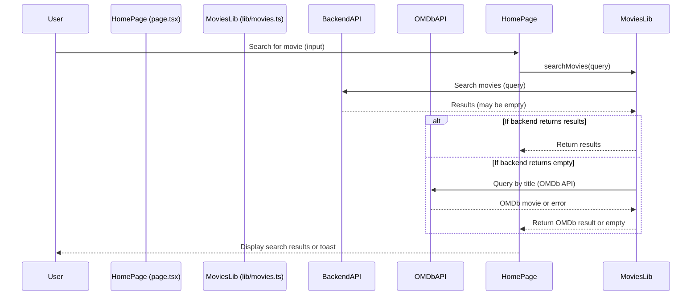

# CinemaAI: Your Personal Movie Recommendation Engine

Welcome to CinemaAI! This is a Next.js web application designed to provide personalized movie recommendations based on your favorite films. You can search for movies, select the ones you like, and our AI-powered backend will suggest other movies you might enjoy.

## How it Works

The application is a standalone frontend built with Next.js and React. It communicates with a separate backend service to fetch movie data and generate recommendations.

The user flow is simple:
1.  **Search & Select:** Find movies you like using the search bar.
2.  **Choose Genres:** Pick one or more genres you're interested in.
3.  **Build Your List:** Click on movie posters to add them to your selection list.
4.  **Get Recommendations:** Click the "Generate Recommendations" button to receive a personalized list of movies.

## Tech Stack

- **Framework:** Next.js (with App Router)
- **Language:** TypeScript
- **Styling:** Tailwind CSS with ShadCN UI components
- **UI:** React

## Getting Started

To run this project locally, follow these steps:

1.  **Install Dependencies:**
    ```bash
    npm install
    ```

2.  **Run the Development Server:**
    ```bash
    npm run dev
    ```

The application will be available at `http://localhost:9002`.

---

## API Documentation

The frontend application interacts with a backend API through a proxy set up within the Next.js application to avoid CORS issues. All client-side requests are made to `/api/...`, which then forward the requests to the production backend.

**Backend Base URL:** `https://cinemaai-backend.onrender.com`

### 1. Fetch All Movies

- **Frontend Route:** `GET /api/movies`
- **Backend Endpoint:** `GET /movies`
- **Description:** Retrieves an initial list of all available movies to display when the page loads.
- **Request:** No request body or parameters.
- **Response Body:** An array of movie objects.

**Example Movie Object:**
```json
{
  "id": "tt0111161",
  "title": "The Shawshank Redemption",
  "overview": "Two imprisoned men bond over a number of years, finding solace and eventual redemption through acts of common decency.",
  "genres": "Drama",
  "cast": "Tim Robbins, Morgan Freeman, Bob Gunton",
  "poster_path": "https://m.media-amazon.com/images/M/MV5BNDE3ODcxYzMtY2YzZC00NmNlLWJiNDMtZDViZWM2MzIxZDYwXkEyXkFqcGdeQXVyNjAwNDUxODI@._V1_SX300.jpg",
  "vote_average": 9.3,
  "release_date": "1994"
}
```

### 2. Search for Movies

- **Frontend Route:** `GET /api/search/[identifier]`
- **Backend Endpoint:** `GET /search/{identifier}`
- **Description:** Searches for movies by title or IMDb ID.
- **URL Parameter:**
  - `identifier` (string): The movie title or IMDb ID to search for.
- **Response Body:** An array of movie objects matching the search query.

### 3. Get Movie Recommendations

- **Frontend Route:** `POST /api/recommend`
- **Backend Endpoint:** `POST /recommend`
- **Description:** Generates personalized movie recommendations based on a user's selections. The recommendations are guaranteed to be sourced from the backend and are not generated on the client side.
- **Request Body:**
```json
{
  "movie_ids": ["tt0111161", "tt0068646"],
  "num_recommendations": 10
}
```
  - `movie_ids` (array of strings): A list of IMDb IDs for the movies the user has selected.
  - `num_recommendations` (integer): The desired number of recommendations.
- **Response Body:** An array of recommended movie objects, with the same structure as in the `/movies` endpoint response.

<!-- This is an auto-generated comment: summarize by coderabbit.ai -->
<!-- walkthrough_start -->

## Walkthrough OF Version 2 Chnages 

This update introduces a sample environment file, refines the `.gitignore` for environment and package manager files, and adds a `postinstall` script to `package.json`. The UI and styling are overhauled: font loading uses Next.js's font API, color variables and radii are updated, and genre selection is removed from the movie selection flow. Movie search now includes an OMDb API fallback, and the `MovieCard` component is visually revamped with enhanced hover and selection effects. Tailwind's font configuration is streamlined to use a CSS variable.

## Changes

| Cohort / File(s) | Change Summary |
|------------------|---------------|
| **Environment and Ignore Files**<br>`.env.sample`, `.gitignore` | Added a sample environment file with instructions and a placeholder API key. Updated `.gitignore` to better handle environment files and package manager artifacts, removing and refining several patterns. |
| **Package Scripts**<br>`package.json` | Added a `postinstall` script to run `patch-package` after installs. Minor formatting update. |
| **Global Styling and Fonts**<br>`src/app/globals.css`, `tailwind.config.ts`, `src/app/layout.tsx` | Updated color palette, border radius, and removed sidebar variables in CSS. Switched font loading to Next.js's font API and streamlined Tailwind's font config to use a variable. |
| **Movie Selection & Search Flow**<br>`src/app/page.tsx`, `src/lib/movies.ts` | Refactored movie fetching and search to use an OMDb API fallback, removed genre selection, improved error handling, and updated UI/UX for movie selection and recommendations. Adjusted `getMoviesByIds` to accept pre-fetched movies. |
| **Movie Card UI**<br>`src/components/movie-card.tsx` | Overhauled card visuals: removed tooltips, added new hover/selection overlays, updated layout, and improved image and overlay effects. |

## Sequence Diagram(s)



